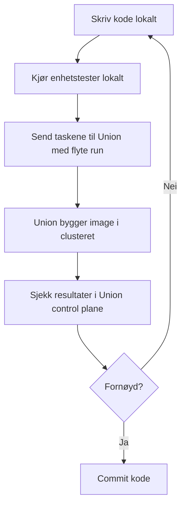

# union-template

Template for å opprette nye Union-repoer.

## Flyt for pipelineutvikling

Start med lokal kode og test endringer med `flyte run` mot `development`.



En typisk struktur kan være:

```text
.
├── workflow.py
├── manifests/
│   ├── utsa-dev.yaml
│   ├── utsa-staging.yaml
│   └── utsa-prod.yaml
├── pyproject.toml
├── tests/
│   └── test_workflow.py
└── README.md
```

Initialiser prosjektet med uv, og legg inn de nødvendige avhengighetene. For et minimalt workflow-prosjekt holder det med flyte og pytest; legg til domeneavhengigheter etter behov.

```bash
uv venv
source .venv/bin/activate
uv sync --dev
uv run pytest
```

For å legge til nye avhengigheter senere:

```bash
uv add <pakke>
uv add --dev <pakke>
uv sync --dev
```

Opprett Flyte-konfigurasjon og test tilgang:

```bash
flyte create config --endpoint union.data.nav.no --org union-nav --project <prosjekt> --domain development
flyte get project
```

Kjør og deploy til Union:

```bash
flyte run --domain development workflow.py main
flyte deploy --domain development --all workflow.py
```

## Team-spesifikk konfigurasjon

Template for service accounts ligger i [manifests/utsa-dev.yaml](manifests/utsa-dev.yaml), [manifests/utsa-staging.yaml](manifests/utsa-staging.yaml) og [manifests/utsa-prod.yaml](manifests/utsa-prod.yaml). Bytt ut `<team>` og oppdater allowlists etter behov.

Manifestet kan deployes med felles GitHub Action `navikt/union-config` (se KNADA-dokumentasjonen for eksempel-workflow).

Før koden kjøres i Union bør den kunne importeres og testes lokalt. Hold selve task-funksjonene små, og flytt gjerne domenelogikk til vanlige Python-funksjoner som kan testes uten Union.

Se også dokumentasjonen for bruk av Union: https://docs.knada.io/analyse/union/bruk/
