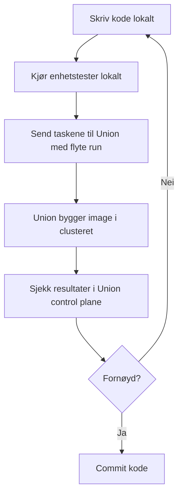

# union-template

Template for å opprette nye Union-repoer.

## Flyt for pipelineutvikling

Start med lokal kode og test endringer med `flyte run` mot `development`.



En typisk struktur kan være:

```text
.
├── workflow.py
├── pyproject.toml
├── tests/
│   └── test_workflow.py
└── README.md
```

Initialiser prosjektet med `uv`, og legg inn de nødvendige avhengighetene. For et minimalt workflow-prosjekt holder det med `flyte` og `pytest`; legg til domeneavhengigheter etter behov.

```bash
uv init --bare
uv add flyte==2.2.4
uv add --dev pytest
uv run pytest
```

Før koden kjøres i Union bør den kunne importeres og testes lokalt. Hold selve task-funksjonene små, og flytt gjerne domenelogikk til vanlige Python-funksjoner som kan testes uten Union.

Se også dokumentasjonen for bruk av Union: https://docs.knada.io/analyse/union/bruk/
